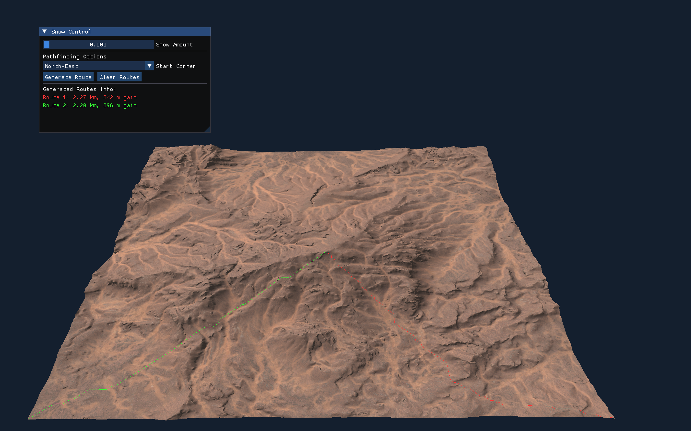
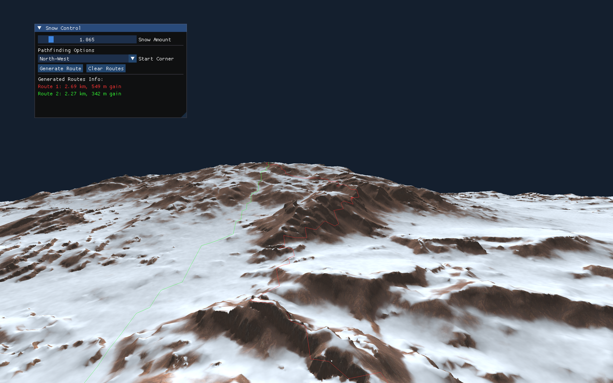

# Projekt: Grafika Komputerowa - Symulacja 3D

Projekt w technologii OpenGL renderujący model 3D szczytu górskiego z obsługą proceduralnego śniegu, oświetlenia oraz wyznaczaniem ścieżek.

## Główne Funkcjonalności

*   **Proceduralny Śnieg:** Generowany dynamicznie we fragment shaderze (Value Noise, FBM). Intensywność zależna od kąta nachylenia zbocza i zmiennej `snowLevel`.
*   **Pathfinding (A*):** Algorytm wyznaczający najkrótszą trasę na szczyt. Unika terenów stromych oraz obszarów pokrytych dużą ilością śniegu. Rzutuje siatkę 3D na mapę 2D (Height Grid).
*   **Normal Mapping:** Obliczany z użyciem pochodnych ekranowych (`dFdx`, `dFdy`). Symuluje wypukłości i chropowatość bez dodatkowej geometrii.
*   **Oświetlenie:** Model kierunkowy (Diffuse) i otoczenia (Ambient).
*   **Kamera Free-Fly:** Sterowana klawiaturą, oparta na kątach Eulera. Blokada osi Pitch na 89 stopniach zapobiega zjawisku Gimbal Lock.

## Sterowanie

*   **W / S / A / D** - Ruch poziomy.
*   **Q / E** - Lot pionowy (oś Y).
*   **Strzałki** - Obrót kamery (Pitch i Yaw).
*   **Podwójne kliknięcie (W/S/A/D/Q/E w 0.4s)** - Tryb "Sprint", x5 prędkości.
*   **Interfejs (ImGui)** - Zmiana zmiennej śniegu (`snowLevel`) i punktu startowego dla trasy.

## Wymagania (macOS)

```bash
brew install glfw glew glm
```

## Kompilacja i Uruchomienie

```bash
mkdir build && cd build
cmake ..
make
./grafika_app
```

## Galeria


*Rys 1. Prezentacja wyrenderowanego szczytu górskiego z nałożonym proceduralnym śniegiem oraz mapowaniem normalnych.*


*Rys 2. Działanie algorytmu Pathfindingu wyznaczającego bezpieczną trasę na szczyt z ominięciem stromych, zaśnieżonych obszarów.*
